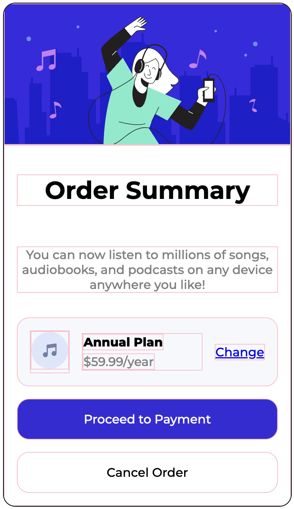

# Review 4

Make a new repository `review-4` (public) where you can upload your work.

Please use an **external stylesheet** to style your HTML.

Recreate the following website:


Points for:
- Header image
- Headline and text below the headline
- Annual plan container (background color, music icon, link)
- The two buttons: "Proceed to Payment" and "Cancel Order"
- All rounded borders correct
- All background colors correct
- All spacing correct
- Document formatted correctly

Hints:
- Do what you can, don't get stuck on one thing.
- The outer container's width is `375px`
- The `src` for the top image is `./illustration-hero.svg`
- Whenever border-radius, padding, gap, or margin is used, it is `16px`, except between "Annual Plan" and "$59.99 / year", where it is `4px`
- Annual plan container background: `hsl(228, 56%, 98%)`
- Dark blue button background: `hsl(244, 69%, 51%)`

## Font

To get the exact font used, put this code in your HTML's `<head>`:

```html
<link rel="preconnect" href="https://fonts.googleapis.com">
<link rel="preconnect" href="https://fonts.gstatic.com" crossorigin>
<link href="https://fonts.googleapis.com/css2?family=Atkinson+Hyperlegible+Mono:ital,wght@0,200..800;1,200..800&family=Montserrat:ital,wght@0,100..900;1,100..900&family=Red+Hat+Display:ital,wght@0,300..900;1,300..900&display=swap" rel="stylesheet">
```

and this in your CSS:

```css
body {
  font-family: "Montserrat", serif;
  font-optical-sizing: auto;
  font-weight: 500;
  font-style: normal;
  text-align: center;
}
```

<details>
  <summary>Hint</summary>
  Here's the same page with every element bordered

  

</details>